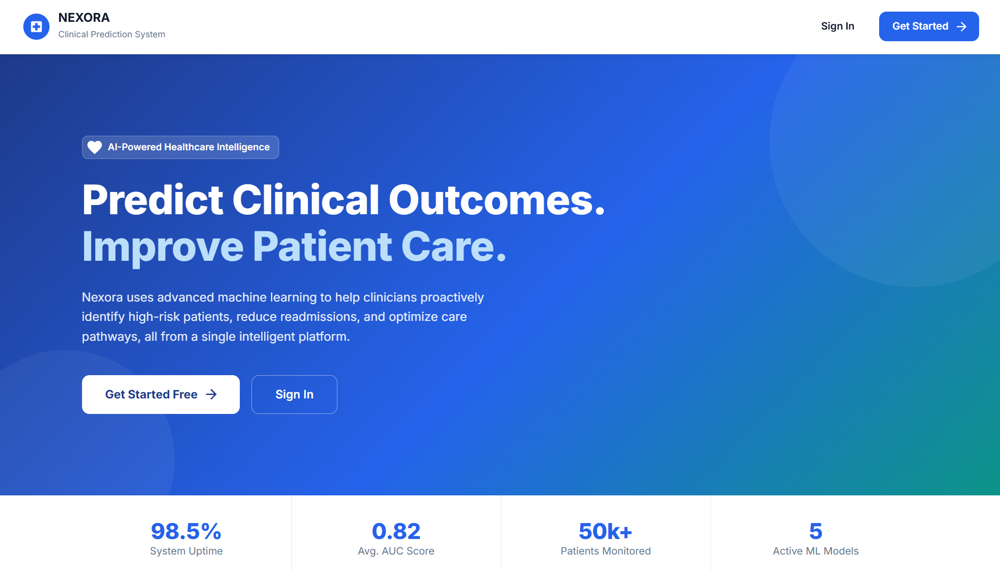

# Nexora


## Clinical Prediction and Patient Risk Platform

Nexora is a clinical prediction platform: a FastAPI backend for auth, patients, predictions, dashboards, and notifications, paired with a React web dashboard, a React Native mobile app, and a Streamlit interface. Every patient route logs PHI access through a real, genuinely-wired `PHIAuditLogger`, backed by a real FHIR connector and a substantial ML library (`code/ml_core`) that includes an optional PyTorch transformer model, model calibration, and quantitative fairness metrics (demographic parity, equal opportunity, equalized odds).

<div align="center">
  
</div>

## Table of Contents

- [Overview](#overview)
- [Project Structure](#project-structure)
- [Feature Status](#feature-status)
- [Technology Stack](#technology-stack)
- [Architecture](#architecture)
- [Installation and Setup](#installation-and-setup)
- [Running the Stack](#running-the-stack)
- [API Surface](#api-surface)
- [Testing](#testing)
- [CI/CD Pipeline](#cicd-pipeline)
- [Documentation](#documentation)
- [Contributing](#contributing)
- [License](#license)

## Overview

Nexora demonstrates a clinical risk-prediction workflow across a real, runnable codebase. The FastAPI backend, `ml_core` ML library, and all three clients (web, mobile, and a Streamlit interface) are wired and covered by tests. Every patient-facing route calls a real PHI audit logger before returning data, backed by a `phi_access.db` file that ships in the repository as a working example of the audit trail.

## Project Structure

```
Nexora/
├── code/
│   ├── backend/                 # FastAPI application
│   │   ├── app/api/             # auth, patients, dashboard, notifications,
│   │   │                        # plus system/models/prediction/FHIR/monitoring/
│   │   │                        # compliance routes in routes.py
│   │   ├── app/core/            # config, JWT security
│   │   ├── audit/               # Audit logging support code
│   │   ├── interfaces/          # streamlit_app.py, a genuine alternate UI
│   │   ├── serving/             # rest_api.py: builds the FastAPI app and
│   │   │                        # mounts every router
│   │   └── tests/               # Backend test suite
│   └── ml_core/                 # Substantial ML library
│       ├── models/              # transformer_model (optional PyTorch),
│       │                        # deep_fm, survival_analysis, model_calibration,
│       │                        # fairness_metrics, model_registry
│       ├── compliance/          # phi_audit_logger, genuinely called by every
│       │                        # patient route
│       ├── utils/               # fhir_connector, fhir_ops
│       ├── explainability/      # Model explainability tooling
│       ├── feature_store/       # Feature engineering and storage
│       └── tests/               # ml_core's own, larger test suite
├── audit/                       # phi_access.db: a working example audit trail
├── web-frontend/                # React (Parcel) dashboard
├── mobile-frontend/             # React Native (Expo) app
├── infrastructure/              # Docker, Kubernetes, Terraform, Ansible, monitoring
├── scripts/                     # Setup, run, test, and deployment scripts
├── docs/                        # Documentation (this directory)
└── README.md
```

## Feature Status

### Application tier (wired and tested)

| Component                          | Details                                                                                                                                                                                                                                            |
| :--------------------------------- | :------------------------------------------------------------------------------------------------------------------------------------------------------------------------------------------------------------------------------------------------- |
| **API**                            | FastAPI backend (`serving/rest_api.py`) exposing auth, patients, dashboard, and notifications routers, plus a `routes.py` covering system health, model management, prediction, FHIR, monitoring, and compliance endpoints.                        |
| **Auth**                           | JWT sessions. `JWT_SECRET_KEY` falls back to a value explicitly named "dev-only-insecure-secret-change-me-in-production" if unset, with no check that rejects it in production. There is no MFA or field-level encryption anywhere in the backend. |
| **PHI audit logging**              | Every patient route (view, update, delete, and risk recompute) calls a real `PHIAuditLogger` before responding, writing to a SQLite audit database; a working example (`audit/phi_access.db`) ships in the repository.                             |
| **FHIR integration**               | Real FHIR connector and FHIR operations modules in `ml_core/utils`, genuinely called by the `/fhir/patient/{patient_id}/predict` endpoint.                                                                                                         |
| **Prediction model**               | An optional PyTorch transformer model (`ml_core/models/transformer_model.py`), guarded by a try/except import so the rest of the system still works if PyTorch isn't installed.                                                                    |
| **Model calibration and fairness** | Real, quantitative implementations: isotonic and logistic calibration, and fairness metrics including demographic parity, equal opportunity, equalized odds, predictive parity, and per-group calibration and AUC.                                 |
| **Web dashboard**                  | React app bundled with Parcel (not Vite or Create React App), using Material-UI and Chart.js, with a real Cypress end-to-end test setup.                                                                                                           |
| **Mobile app**                     | React Native (Expo) app with React Navigation and a real Detox end-to-end test configuration for iOS and Android.                                                                                                                                  |
| **Streamlit interface**            | A genuine third client, `interfaces/streamlit_app.py`, alongside the React web and mobile apps.                                                                                                                                                    |

## Technology Stack

| Area                | Technology                                                                                 |
| :------------------ | :----------------------------------------------------------------------------------------- |
| Backend API         | Python 3.11+, FastAPI, Uvicorn, Pydantic v2                                                |
| Auth                | PyJWT                                                                                      |
| ML                  | scikit-learn, an optional PyTorch transformer model, model calibration, fairness metrics   |
| Healthcare interop  | FHIR (custom connector and operations modules)                                             |
| Compliance          | A real PHI access audit logger, called on every patient route                              |
| Alternate interface | Streamlit                                                                                  |
| Web frontend        | React 18, Parcel, Material-UI, Chart.js, Cypress (end-to-end)                              |
| Mobile frontend     | React Native, Expo, React Navigation, Detox (end-to-end)                                   |
| Infrastructure      | Docker, Docker Compose, Kubernetes, Terraform, Ansible                                     |
| CI/CD               | GitHub Actions                                                                             |
| Testing             | pytest (backend and ml_core), Jest (web and mobile), Cypress (web e2e), Detox (mobile e2e) |

## Architecture

```
Clients
  ├── web-frontend (React, Parcel)         ── HTTP/JSON ──┐
  ├── mobile-frontend (React Native)      ── HTTP/JSON ──┤
  └── Streamlit interface                ── HTTP/JSON ──┤
                                                         ▼
Backend (FastAPI, serving/rest_api.py)
  ├── Routers   auth, patients, dashboard, notifications, system, models,
  │             prediction, fhir, monitoring, compliance
  └── Audit       PHIAuditLogger, called on every patient route

ML library (code/ml_core, imported directly by the backend)
  models (transformer, DeepFM, survival analysis, calibration, fairness metrics)
  compliance (phi_audit_logger) · utils (fhir_connector, fhir_ops)
  explainability · feature_store
```

See [docs/ARCHITECTURE.md](docs/ARCHITECTURE.md) for detail.

## Installation and Setup

Prerequisites: Python 3.11+ and Node.js 18+.

```bash
git clone https://github.com/abrar2030/Nexora.git
cd Nexora

# Backend (also installs ml_core's dependencies)
cd code/backend
python -m venv venv
source venv/bin/activate      # Windows: venv\Scripts\activate
pip install -r requirements.txt

# Web frontend
cd ../../web-frontend
npm install

# Mobile frontend
cd ../mobile-frontend
npm install
```

For an automated setup:

```bash
git clone https://github.com/abrar2030/Nexora.git
cd Nexora
./scripts/setup_nexora_env.sh
./scripts/run_nexora.sh
```

Full, environment-specific instructions are in [docs/INSTALLATION.md](docs/INSTALLATION.md).

## Running the Stack

```bash
# Full local stack (from infrastructure/, Docker required)
docker compose up -d

# Or run components individually:

# Backend (from code/, venv active in code/backend)
uvicorn backend.serving.rest_api:app --app-dir code --reload
# serves http://0.0.0.0:8000, docs at /docs

# Streamlit interface (from code/backend, venv active)
streamlit run interfaces/streamlit_app.py

# Web dashboard (from web-frontend)
npm start                          # http://localhost:3000 (Parcel)

# Mobile app (from mobile-frontend)
npm start
```

See [docs/USAGE.md](docs/USAGE.md) and [docs/CONFIGURATION.md](docs/CONFIGURATION.md).

## API Surface

Base URL `http://localhost:8000`. Interactive docs at `/docs` (Swagger) and `/redoc`.

| Group         | Prefix                               | Highlights                                                          |
| :------------ | :----------------------------------- | :------------------------------------------------------------------ |
| Auth          | `/auth`                              | `login`, `me`, `change-password`, `logout`                          |
| Patients      | `/patients`                          | `{patient_id}` (get, update, delete), `{patient_id}/recompute-risk` |
| Dashboard     | `/dashboard`                         | `summary`                                                           |
| Notifications | `/notifications`                     | list, `read-all`                                                    |
| System        | `/health`                            | Liveness check                                                      |
| Models        | `/models`                            | list, `{model_name}/{version}` (delete)                             |
| Prediction    | `/predict`                           | Run a prediction                                                    |
| FHIR          | `/fhir/patient/{patient_id}/predict` | Predict directly from a FHIR patient record                         |
| Monitoring    | `/metrics`                           | Model and system metrics                                            |
| Compliance    | `/audit/patient/{patient_id}`        | Retrieve the PHI access audit trail                                 |

Full request and response shapes are in [docs/API.md](docs/API.md).

## Testing

```bash
# Backend (from code/backend)
pytest

# ML library (from code/ml_core)
pytest

# Web (from web-frontend)
npm test
npm run test:e2e                   # Cypress

# Mobile (from mobile-frontend)
npm test
npm run e2e:test:ios               # or e2e:test:android (Detox)
```

`code/ml_core` has the larger of the two Python test suites, with 18 test files covering clinical logic, compliance, the data pipeline, explainability, model factories, individual models, monitoring, and shared utilities. The backend itself has 3 test files. The web dashboard has 6 test files plus Cypress end-to-end coverage; the mobile app has 9 plus Detox end-to-end coverage.

## CI/CD Pipeline

GitHub Actions (`.github/workflows/cicd.yml`) runs three jobs on push, pull request, and manual dispatch:

| Job                 | Depends on          | What it does                                                                       |
| :------------------ | :------------------ | :--------------------------------------------------------------------------------- |
| Code Quality Checks | -                   | Python formatter checks (autoflake, black) and a repository-wide Prettier check    |
| Backend Tests       | Code Quality Checks | Runs the pytest suite with coverage and uploads the coverage report as an artifact |
| Frontend Build      | Code Quality Checks | Installs dependencies and produces the production web build (no test step)         |

There is currently no CI job for `ml_core`'s own test suite or for the mobile app.

## Documentation

| Document                                           | Contents                               |
| :------------------------------------------------- | :------------------------------------- |
| [docs/README.md](docs/README.md)                   | Documentation index                    |
| [docs/ARCHITECTURE.md](docs/ARCHITECTURE.md)       | System architecture                    |
| [docs/API.md](docs/API.md)                         | REST API reference                     |
| [docs/INSTALLATION.md](docs/INSTALLATION.md)       | Setup for all components               |
| [docs/CONFIGURATION.md](docs/CONFIGURATION.md)     | Environment variables and config       |
| [docs/USAGE.md](docs/USAGE.md)                     | Running and using the platform         |
| [docs/CLI.md](docs/CLI.md)                         | Helper scripts reference               |
| [docs/FEATURE_MATRIX.md](docs/FEATURE_MATRIX.md)   | Feature status, implemented vs planned |
| [docs/TROUBLESHOOTING.md](docs/TROUBLESHOOTING.md) | Common issues and fixes                |
| [docs/CONTRIBUTING.md](docs/CONTRIBUTING.md)       | Contribution guide                     |
| [docs/examples/](docs/examples/)                   | Worked examples                        |

## Contributing

See [docs/CONTRIBUTING.md](docs/CONTRIBUTING.md).

## License

This project is licensed under the MIT License - see the [LICENSE](LICENSE) file for details.
